# Docker

## 概要

### そもそもコンテナ技術の特徴とは
  * 軽量な実行環境
  * 高いポータビリティ
    * ポータビリティとは
      * コンテナイメージの軽量さとその挙動の再現性の高さ
      * 業界標準仕様によるコンテナへの統一的な操作方法
  * 巨大なエコシステム
    OSSがすごい. Docker, Kubernetes.


### Dockerアーキテクチャ



## Dockerの実行

### Command

|上流|command(* .. 上流省略可能)|よく使うoption|説明|
|--|--|--|--|
|container|start*|-a/-i|コンテナを開始する|
||stop*|-t|コンテナを停止する|
||create*|-a/-e/-i/-p/-v|Dockerイメージからコンテナを作成する|
||run*|-d|Dockerイメージをダウンロードし、コンテナを作成して起動する。docker pull, docker create, docker start をまとめたコマンド.|
||exec*|--name/-e/-i/-t/-p/-v||
||ls||= docker ps<br/>コンテナー一覧を表示する|
||cp*||DockerコンテナとDockerホスト間でファイルをコピーする|
||commit*||Dockerコンテナをイメージに変換する|
||rm*||Dockerコンテナを削除する|
|image|pull*|||
||search|||
||rm||=docker rmi|
||ls||自分がダウンロードしたイメージ一覧を表示する|
||build*||Dockerイメージを作成する|
|volume|create|||
||inspect|||
||rm|||
|network|create|||
||inspect||ネットワークの詳細を表示する|
||rm|||
||connect||コンテナをネットワークに接続する|
||disconnect||コンテナをネットワークから切断する|
||ls||ネットワークの一覧を表示する|
||prune||現在コンテナがつながっていないネットワークを全て削除する|

* volume
コンテナからマウントできるストレージの操作を行う。
* network
Docker同士が接続するのに使う仮想的なネットワークDockerネットワークの操作を行う。
* ContainerとHost間でファイルをコピーする
docker cpを使う。

### Volumeのマウントに関して
2種類ある。
#### ボリュームマウント
DockerEngineが管理している領域内にボリュームを作成し、ディスクとして今天谷マウントします。
名前だけで管理できるので、手軽に扱える反面、ボリュームに対して、直接操作しづらいので、「仮で使いたい場合」、「滅多に触らないが、消してはいけないファイル」をおくのに使うことが多い。

|||
|--|--|
|Conatiner||
|Docker Engine|Mount|
|Host OS|NOT|

#### バインドマウント

DockerをインストールしたPCに存在するディレクトリをコンテナにマウントする。ファイル単位でも可能
フォルダにたいhしてファイルもおくことができる。

|||
|--|--|
|Conatiner||
|Docker Engine|NOT|
|Host OS|Mount|

`docker run -v [volume名]:[PATH]`

## コンテナーのイメージ化

Dockerfileを作る。

### Build, Ship, Run の実践
```sh
% cd dev/docker/assets/samples/myimage 
% ls
% cat <<EOF >  hello.sh
heredoc> #!/bin/bash
heredoc> echo "Hello, World!"
heredoc> exec sleep infinity
heredoc> EOF
% chmod +x hello.sh 
% cat <<EOF >  Dockerfile
heredoc> FROM ubuntu:20.04
heredoc> COPY ./hello.sh /hello.sh
heredoc> ENTRYPOINT [ "/hello.sh" ]
heredoc> EOF
% docker build -t myimage:v1 .   
Sending build context to Docker daemon  3.072kB
Step 1/3 : FROM ubuntu:20.04
20.04: Pulling from library/ubuntu
345e3491a907: Pull complete 
57671312ef6f: Pull complete 
5e9250ddb7d0: Pull complete 
Digest: sha256:cf31af331f38d1d7158470e095b132acd126a7180a54f263d386da88eb681d93
Status: Downloaded newer image for ubuntu:20.04
 ---> 7e0aa2d69a15
Step 2/3 : COPY ./hello.sh /hello.sh
 ---> 8a968d611aad
Step 3/3 : ENTRYPOINT [ "/hello.sh" ]
 ---> Running in d3a43a91fd8d
Removing intermediate container d3a43a91fd8d
 ---> c17a675837ad
Successfully built c17a675837ad
Successfully tagged myimage:v1
% docker run myimage:v1
Hello, World!
% docker image ls
REPOSITORY                           TAG                                                     IMAGE ID       CREATED         SIZE
myimage                              v1                                                      c17a675837ad   5 minutes ago   72.7MB
% docker tag myimage:v1 szkrkr/myimage:v1
% docker push szkrkr/myimage:v1
The push refers to repository [docker.io/szkrkr/myimage]
8833c0329e1a: Pushed 
2f140462f3bc: Mounted from library/ubuntu 
63c99163f472: Mounted from library/ubuntu 
ccdbb80308cc: Mounted from library/ubuntu 
v1: digest: sha256:bfdbf07b41369ca5e0aa4929e4be4913c9ddb83ac25930027dc336d52ba733f6 size: 1150
% docker pull szkrkr/myimage:v1
v1: Pulling from szkrkr/myimage
Digest: sha256:bfdbf07b41369ca5e0aa4929e4be4913c9ddb83ac25930027dc336d52ba733f6
Status: Image is up to date for szkrkr/myimage:v1
docker.io/szkrkr/myimage:v1
% docker run szkrkr/myimage:v1 
Hello, World!
```

## docker-compoase
下記のdocker cliを一つのYAMLにまとめることができる、。

```
docker network create wordpress000net1
```
```
docker run --name mysql000ex11 -dit --net=wordpress000net1 -e MYSQL_ROOT_PASSWORD=      MYSQL_ROOT_PASSWORD: rootpass -e MYSQL_DATABASE=wordpress000db -e MYSQL_USER=szkrkr -e MYSQL_PASSWORD=pass mysql --character-set-server=utf8mb4 --collation-server=utf8mb4_unicode_ci --default-authentication-plugin=mysql_native_password
```
```
docker run --name mysql000ex12 -dit --net=wordpress000net1 -p 8085:80 -e WORDPRESS_DB_HOST=mysql000ex11 -e WORDPRESS_DB_NAME=wordpress000db -e WORDPRESS_DB_USER=szkrkr -e WORDPRESS_DB_PASSWORD=pass wordpress
```

-> yml file
```
version: "3"

services: 
  mysql000ex11:
    image: mysql:5.7
    networks:
      - wordpress000net1 
    volumes:
      - mysql000vol11:/var/lib/mysql
    restart: always
    environment: 
      MYSQL_ROOT_PASSWORD: rootpass
      MYSQL_DATABASE: wordpress000db
      MYSQL_USER: szkrkr
      MYSQL_PASSWORD: pass
  wordpress000ex12:
    depends_on: 
      - mysql000ex11
    image: wordpress
    networks: 
      - wordpress000net1
    volumes: 
      - wordpress000vol12:/var/www/html
    ports:
      - 8085:80
    restart: always
    environment: 
      WORDPRESS_DB_HOST: mysql000ex11
      WORDPRESS_DB_NAME: wordpress000db
      WORDPRESS_DB_USER: szkrkr
      WORDPRESS_DB_PASSWORD: pass
networks:
  wordpress000net1:
volumes:
  mysql000vol11:
  wordpress000vol12:
```


## コンテナイメージ

### コンテナイメージ解剖

|どんなデータがで構成されているか|ファイル名|
|--|--|
|コンテナが用いるルートファイルシステムのデータ|layer.tar|
|実行コマンドや環境変数など、実行環境を再現するための情報|c17a.....1144f.json|
|イメージの構成などに関する情報|manifest.json, repositories|
| その他（過去の仕様との互換性のために保持されるファイル群)|VESION, json|

```sh
% docker save szkrkr/myimage:v1 | tar -xC ./dumpimage
% tree ./dumpimage
./dumpimage
├── 1392a7609ae8d845eba5fbe95e266a6b104d55b30262a284c960583f91307420
│   ├── VERSION
│   ├── json
│   └── layer.tar
├── 15cbe1c29902a1020a4a47c835a82f0416f1896f02fac942fdd35d326c63fa22
│   ├── VERSION
│   ├── json
│   └── layer.tar
├── 20f79c86180273e5ac0f522f4fd6a333f210784f0865dbaf020877d549bc4f8d
│   ├── VERSION
│   ├── json
│   └── layer.tar
├── 6d56becb66b184f78b25f61dc91f68fcfce4baeecb3a8dcb21ada2306091aab7
│   ├── VERSION
│   ├── json
│   └── layer.tar
├── c17a675837adfca54876833c67a451e85d0c4f502c78eae847fc52b9faa1144f.json
├── manifest.json
└── repositories

4 directories, 15 files
szkrkr@suzukirokurounoMacBook-Pro-2 myimage % tar --list -f ./dumpimage/1392a7609ae8d845eba5fbe95e266a6b104d55b30262a284c960583f91307420/layer.tar | head -n 10
run/
run/systemd/
run/systemd/.wh..wh..opq
run/systemd/container
szkrkr@suzukirokurounoMacBook-Pro-2 myimage % tar --list -f ./dumpimage/15cbe1c29902a1020a4a47c835a82f0416f1896f02fac942fdd35d326c63fa22/layer.tar | head -n 1
bin
szkrkr@suzukirokurounoMacBook-Pro-2 myimage % tar --list -f ./dumpimage/20f79c86180273e5ac0f522f4fd6a333f210784f0865dbaf020877d549bc4f8d/layer.tar | head -n 1
hello.sh
szkrkr@suzukirokurounoMacBook-Pro-2 myimage % tar --list -f ./dumpimage/6d56becb66b184f78b25f61dc91f68fcfce4baeecb3a8dcb21ada2306091aab7/layer.tar | head -n 1
etc/
```

### レイヤとコンテナ実行
CoWを知る。
　　



### レイヤとビルド
すでに同じイメージでビルドされている場合、キャッシュされる。
```
szkrkr@suzukirokurounoMacBook-Pro-2 hello % docker build -t hello:v1 .      
Sending build context to Docker daemon  3.072kB
Step 1/5 : FROM ubuntu:20.04
 ---> 7e0aa2d69a15
Step 2/5 : RUN apt-get update
 ---> Running in bcc8dc051cdb
  :
 ---> 634f8b8d5ab3
Step 3/5 : RUN apt-get install -y figlet
 ---> Running in f564cfbe6662
  :
 ---> c83131622fd1
Step 4/5 : COPY ./hello.sh /hello.sh
 ---> ef604fed0f57
Step 5/5 : ENTRYPOINT [ "/hello.sh" ]
 ---> Running in a39beb43ef3a
Removing intermediate container a39beb43ef3a
 ---> 23f3fe28a651
Successfully built 23f3fe28a651
Successfully tagged hello:v1
szkrkr@suzukirokurounoMacBook-Pro-2 hello % docker run --rm --name=helo1 hello:v1
 _   _      _ _         __        __         _     _ _ 
| | | | ___| | | ___    \ \      / /__  _ __| | __| | |
| |_| |/ _ \ | |/ _ \    \ \ /\ / / _ \| '__| |/ _` | |
|  _  |  __/ | | (_) |    \ V  V / (_) | |  | | (_| |_|
|_| |_|\___|_|_|\___( )    \_/\_/ \___/|_|  |_|\__,_(_)
szkrkr@suzukirokurounoMacBook-Pro-2 samples % cd ..
szkrkr@suzukirokurounoMacBook-Pro-2 samples % cp -r hello hello2
szkrkr@suzukirokurounoMacBook-Pro-2 samples % vi ./hello2/hello.sh
szkrkr@suzukirokurounoMacBook-Pro-2 samples % docker build -t hello:v2 ./hello2
Sending build context to Docker daemon  3.072kB
Step 1/5 : FROM ubuntu:20.04
 ---> 7e0aa2d69a15
Step 2/5 : RUN apt-get update
 ---> Using cache
 ---> 634f8b8d5ab3
Step 3/5 : RUN apt-get install -y figlet
 ---> Using cache
 ---> c83131622fd1
Step 4/5 : COPY ./hello.sh /hello.sh
 ---> 95bb577eb37f
Step 5/5 : ENTRYPOINT [ "/hello.sh" ]
 ---> Running in 1eba3d4fd497
Removing intermediate container 1eba3d4fd497
 ---> 0d1bbea0d708
Successfully built 0d1bbea0d708
Successfully tagged hello:v2
szkrkr@suzukirokurounoMacBook-Pro-2 samples % docker run --rm --name=hello2 hello:v2
 ___ _        __        __         _        _ 
|_ _| |_      \ \      / /__  _ __| | _____| |
 | || __|      \ \ /\ / / _ \| '__| |/ / __| |
 | || |_   _    \ V  V / (_) | |  |   <\__ \_|
|___|\__| ( )    \_/\_/ \___/|_|  |_|\_\___(_)
          |/  
```

## TroubleShooting

- COPY: *ではなく.を使用する
```
× COPY　build/libs/* .
○ COPY build/libs/. .
```


## Glosarry
* コンテナイメージ  
  コンテナ実行の素
* コンテナレジストリ  
  イメージ配布用サーバ
* コンテナランタイム  
  Dockerなど
* Build, Ship, Run  
  基本コンセプト
* レイヤ  
  変更差分
* Docker クライアント
  docker cli など
* Docker デーモン (dockerd)
  コマンドからDOckerAPI経由でデーモンに指示。
  イメージのpull/pushはDockerデーモンが行う。
* OCIランタイム
  低レベルランタイム
  コンテナーの作成など


## 参考
* [イラストでわかるDockerとKubernetes](https://www.amazon.co.jp/dp/B08PNMRXKN/)
* 

