# Docker

## Command

|上流|command(* .. 上流省略可能)|よく使うoption|説明|
|--|--|--|--|
|container|start*|-a/-i|コンテナを開始する|
||stop*|-t|コンテナを停止する|
||create*|-a/-e/-i/-p/-v|Dockerイメージからコンテナを作成する|
||run*|-d|Dockerイメージをダウンロードし、コンテナを作成して起動する。docker pull, docker create, docker start をまとめたコマンド.|
||exec*|--name/-e/-i/-t/-p/-v||
||ls||= docker ps<br/>コンテナー一覧を表示する|
||cp*||DockerコンテナとDockerホスト間でファイルをコピーする|
||commit*||Dockerコンテナをイメージに変換する|
||rm*||Dockerコンテナを削除する|
|image|pull*|||
||search|||
||rm||=docker rmi|
||ls||自分がダウンロードしたイメージ一覧を表示する|
||build*||Dockerイメージを作成する|
|volume|create|||
||inspect|||
||rm|||
|network|create|||
||inspect||ネットワークの詳細を表示する|
||rm|||
||connect||コンテナをネットワークに接続する|
||disconnect||コンテナをネットワークから切断する|
||ls||ネットワークの一覧を表示する|
||prune||現在コンテナがつながっていないネットワークを全て削除する|

* volume
コンテナからマウントできるストレージの操作を行う。
* network
Docker同士が接続するのに使う仮想的なネットワークDockerネットワークの操作を行う。


## ContainerとHost間でファイルをコピーする
docker cpを使う。

## Volumeをマウントする
2種類ある。
### ボリュームマウント
DockerEngineが管理している領域内にボリュームを作成し、ディスクとして今天谷マウントします。
名前だけで管理できるので、手軽に扱える反面、ボリュームに対して、直接操作しづらいので、「仮で使いたい場合」、「滅多に触らないが、消してはいけないファイル」をおくのに使うことが多い。

|||
|--|--|
|Conatiner||
|Docker Engine|Mount|
|Host OS|NOT|

### バインドマウント

DockerをインストールしたPCに存在するディレクトリをコンテナにマウントする。ファイル単位でも可能
フォルダにたいhしてファイルもおくことができる。

|||
|--|--|
|Conatiner||
|Docker Engine|NOT|
|Host OS|Mount|

`docker run -v [volume名]:[PATH]`

## コンテナーのイメージ化

Dockerfileを作る。


# docker-compoase
下記のdocker cliを一つのYAMLにまとめることができる、。

```
docker network create wordpress000net1
```
```
docker run --name mysql000ex11 -dit --net=wordpress000net1 -e MYSQL_ROOT_PASSWORD=      MYSQL_ROOT_PASSWORD: rootpass -e MYSQL_DATABASE=wordpress000db -e MYSQL_USER=szkrkr -e MYSQL_PASSWORD=pass mysql --character-set-server=utf8mb4 --collation-server=utf8mb4_unicode_ci --default-authentication-plugin=mysql_native_password
```
```
docker run --name mysql000ex12 -dit --net=wordpress000net1 -p 8085:80 -e WORDPRESS_DB_HOST=mysql000ex11 -e WORDPRESS_DB_NAME=wordpress000db -e WORDPRESS_DB_USER=szkrkr -e WORDPRESS_DB_PASSWORD=pass wordpress
```

-> yml file
```
version: "3"

services: 
  mysql000ex11:
    image: mysql:5.7
    networks:
      - wordpress000net1 
    volumes:
      - mysql000vol11:/var/lib/mysql
    restart: always
    environment: 
      MYSQL_ROOT_PASSWORD: rootpass
      MYSQL_DATABASE: wordpress000db
      MYSQL_USER: szkrkr
      MYSQL_PASSWORD: pass
  wordpress000ex12:
    depends_on: 
      - mysql000ex11
    image: wordpress
    networks: 
      - wordpress000net1
    volumes: 
      - wordpress000vol12:/var/www/html
    ports:
      - 8085:80
    restart: always
    environment: 
      WORDPRESS_DB_HOST: mysql000ex11
      WORDPRESS_DB_NAME: wordpress000db
      WORDPRESS_DB_USER: szkrkr
      WORDPRESS_DB_PASSWORD: pass
networks:
  wordpress000net1:
volumes:
  mysql000vol11:
  wordpress000vol12:
```


# Kubernetes

## Glosarry
Pod/Service/ReplicaSet/Deployment



* podtemplate .. デプロイするときのポッドの雛形
* replicationcontrollers .. レプリケーションのコントローラー
* resourcequotas . Kubernetesのリソース使用量の聖g年を設定
* secrets .. 鍵情報を取得
* serviceaccounts .. 操作するアカウントを管理する
* daemonsets .. WorkerNodeごとに1つのPodを作成
* 