# Kubernetes

基本は、 https://kubernetes.io/ja/docs/home/ を参考にすること

## k8s アーキテクチャ


* Cluster .. コンテナ群を実行するマシンの集合
* Node .. コンテナを実行するマシン。Podは常にノード上で動作します。 [^1]
* Pod .. 1つ以上のアプリケーションコンテナ(Dockerなど)のグループとそれらのコンテナの共有リソースを表すKubernetesの抽象概念 [^1]
* Control Plane .. クラスタ全体にわたる状態を管理を担うコンポーネント群
* ワークロード .. Kubernetes上で実行中のアプリケーションです。異なる種類のワークロードやその一部を表すコアオブジェクトはさまざまなものがあり、DaemonSet、Deployment、Job、ReplicaSet、StatefulSetオブジェクトなどがあります。
* kube-apiserver .. クラスターの状態をコントローラーに渡すなどの Kubernetes APIを提供する。
* kube-controller-manager .. 実際のクラスタの実行を処理するコントローラー[^2]、を実行する。
* Deployment .. デプロイ、自動復旧、スケーリング、コンテナ群のアップデート、それに伴うロールバック(ローリングアップデート)を行う。
* ReplicaSet .. 上記Deploymentを行うレプリケーションを行う対象を見極めるためのリソース。
* StatefulSet .. 基本Ephemeralな存在であるPodに対し、データを永続化するためのリソース。
* DaemonSet .. ログやモニタリングなど、Podを跨いで、ノード上のデーモンプロセスのように動くためのリソース。
* Jobs .. Podを単発実行するためのリソース。CronJobもある。
* kube-scheduler .. クラスタの健全性は保たれているか。新しいコンテナが必要な場合、どこにデプロイするのか、などをみる。
* etcd .. 構成データとクラスタの状態に関する情報は、key-value ストアデータベースである etcd 内にあります。etcd は、フォールトトレラントで分散されており、クラスタに関する信頼できる基本的な情報源となるように設計されています。
* ConfigMap .. 機密情報ではない情報を持つ。コンテナの環境変数や、ファイルシステムにマウントし読取専用のファイルとして見せる、などに使う。
* Secrets .. コンテナイメージに含めたくない、秘匿性の高い情報を置いておける。
* Container Runtime .. CRI コンテナランタイム。kubeletからの指示を受け、イメージの取得や、コンテナ群をPodとして作成するソフトウェア。containered や CRI-O などがある。
* kubelet .. コントロールプレーンと通信する小さなアプリケーション
* kube-proxy .. Kubernetes ネットワークサービスを容易にするためのネットワークプロキシ。OSのパケットフィルタリング・レイヤーまたはトラフィック自体の転送に依存して、クラスタ内外のネットワーク通信を処理する。
* Persistant Volume .. 永続的なデータ格納領域。
参考: https://www.redhat.com/ja/topics/containers/kubernetes-architecture

## k8s 構築例



## Pod 


 [^1]
> Podには以下のものが含まれます:
> * 共有ストレージ(ボリューム)
> * ネットワーキング(クラスターに固有のIPアドレス)
> * コンテナのイメージバージョンや使用するポートなどの、各コンテナをどう動かすかに関する情報

## Node 
 [^1]
> すべてのKubernetesノードでは少なくとも以下のものが動作します。
> * Kubelet: Kubernetesマスターとノード間の通信を担当するプロセス。マシン上で実行されているPodとコンテナを管理します。
> * レジストリからコンテナイメージを取得し、コンテナを解凍し、アプリケーションを実行することを担当する、Dockerのようなコンテナランタイム。

## PVとPVC


## サービスディスカバリ 

複数のPodに一つのIPを付与し、一つのサービスとして扱うことができる。

Podに紐づくIPは、デプロイごとに変わったり、デプロイされないとIPがわからない、という問題がある。
それを解決するための手段。

複数のPodはつけたタグにたいして設定ができる。

```
apiVersion: v1
kind: Service
metadata:
  name: nginx-service
spec:
  selector:
    app: nginx
  ports:
  - protocol: TCP
    port: 8080
    targetPort: 80
```


## CRIコンテナランタイム


## AWS EKSに向けてConfigureする

- Role作成
- 権限を与える (system masterが最大)
- profileに記載する
- aws configureにする
- aws eks update-kubeconfig --name {name} --profile {profile_name}`
- kubectl config get-contexts
- kubectl get pod -n {namespace} --context {context_name}

## Portforwardする

- kubectl -n {namespace} port-forward deployment/{deployment_name} 8084:80 --context {context_name}

こうすると localhost:8084 にアクセスで、ポッド内の 80　ポートにつなぐ。

https://www.containiq.com/post/kubectl-port-forward

https://udomomo.hatenablog.com/entry/2020/11/01/235612

- & を最後につけるとbackground processになる。その場合は、 `pkill -f "port-forward"` でプロセスのキルができる

https://stackoverflow.com/questions/37288500/how-to-undo-a-kubectl-port-forward

## 立ち上がらない

### ImagePullBackOff

#### Case 1 
- log
```
container "db-operation" in pod "db-operation-jlv4t" is waiting to start: trying and failing to pull image
```

- cause

imagePullSecret の設定が間違い。 ないものを指定していた。

- solution

指定し直したらOK！

### CrashLoopBackOff

#### Case1

flywayによるmigrationの失敗


[^1]: [「Podとノードについて」](https://kubernetes.io/ja/docs/tutorials/kubernetes-basics/explore/explore-intro/)
[^2]: [コントローラ](https://kubernetes.io/ja/docs/concepts/architecture/controller/)
