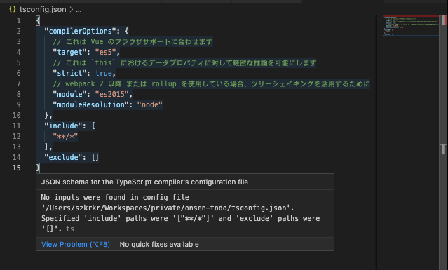
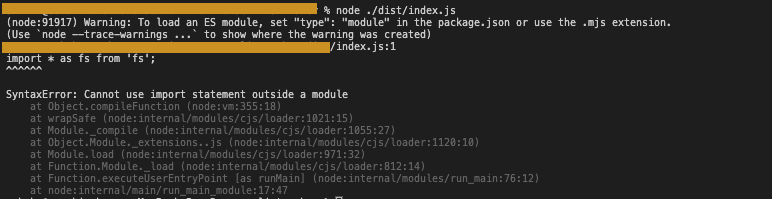

# TypeScript/JavaScript

## TypeScript

### cookie, session storage, local storageに保存したいときに使える
https://codesandbox.io/s/web-storage-inteface-897nl

### JWT with custom claim typescrit sample
https://codesandbox.io/s/jwt-decode-sample-g27yk

### Utility Typesいつ使う???

* Partial<T> -> interafaceちゃんと整理すれば使わない?
* Required<T> -> interafaceちゃんと整理すれば使わない?
* Readonly<T> -> interafaceちゃんと整理すれば使わない?
* Record<K, T> -> { [playerId: string]: Player } とかしないですむ。
* Pick<T,K> -> interafaceちゃんと整理すれば使わない?
* Omit<T,K> -> interafaceちゃんと整理すれば使わない?
* Exclude<T,U>　→ 継承関係整理する必要があるのでは??
* Extract<T,U>　→ 継承関係整理する必要があるのでは??
* NonNullable<T> -> どこで使うの..
* Parameters<T> -> 引数の型はよくとるから
* ConstructorParameters<T>　→ Tuple化しないでよくね??
* ReturnType<T> -> Reduxとかでも使える。このtypeなら、このReturn的な感じで。
* ThisParameterType　→？
* OmitThisParameter　→？
* ThisType<T>　→[？](https://stackoverflow.com/questions/55029032/what-is-typescripts-thistype-used-for)

* https://www.typescriptlang.org/docs/handbook/utility-types.html
* https://qiita.com/k-penguin-sato/items/e2791d7a57e96f6144e5

### fakeのtypescriptが必要？？？？？
  
Vue Project使用中..  
https://stackoverflow.com/questions/41211566/tsconfig-json-buildno-inputs-were-found-in-config-file

### package.json, tsconfig関連 -> cannot-use-import-statement-outside-a-module


`"type": "module",`をpackage.jsonに
https://fredriccliver.medium.com/syntaxerror-cannot-use-import-statement-outside-a-module-69182014b8c6

### exports is not defined
```
file:///sample/dist/index.js:2
Object.defineProperty(exports, "__esModule", { value: true });
                      ^

ReferenceError: exports is not defined
    at file:///sample//dist/index.js:2:23
```

package.json
`"module": "commonjs"` -> `"module": "ES2015"`

## JavaScript


## Library

### Charts
* Kinds Of Chart are followings.
  * [Highcharts](https://www.highcharts.com/demo)
  * [Google Charts](https://developers.google.com/chart/interactive/docs)
  * [Chart.js](https://www.chartjs.org/docs/latest/)

* 逆引き
  * 4象限マトリクスを作りたい場合は、Scatter Chart とか　Bubble Chartをつかう。Labelの表示はChart.jsではできない。

