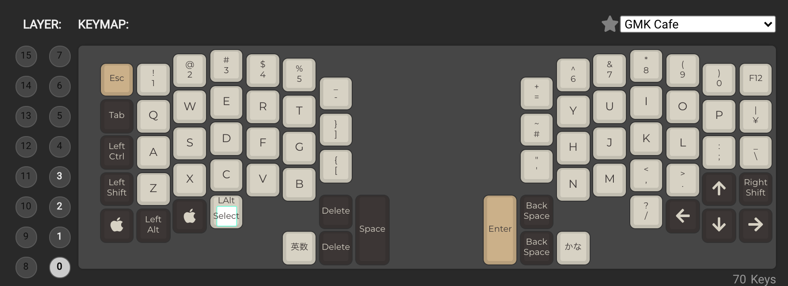

# キーボード自作 - Ergodash

## 概要
友人から、Ergodashをいただいたので、慣れない手で電子工作して作っていきました。

制作時間 .. 合計 6時間程度

## 所感

時間がかかったのは、ダイオードとキーボードの半田付け。ただし、これは久しぶりだったこともあって、結構楽しい。
一番辛かったのは、ソフトウェア屋であるにもかかわらず、なかなかトラブルシューティングできなかった QMK Firmwareのアップデート の方..

## トラブル/反省

### Hard組み立て

* 半田付けが綺麗にできなかった
  * そもそも下手なので、はんだが浸透していない部分が多い。
  * ハンダゴテの先が茶色くなって、先があったまらないようになってからは特に半田付けがうまくいかない。使い方が悪かったかも
  →[ハンダゴテの手入れ方法を知る](http://startelc.com/elcLink/craft/sldrMent1.html)

* 綺麗に基盤にくっついてない。ダイオードが浮いている。
→マスキングテープで、裏からダイオードを抑えつつやるようにする。

* 資料で読みにくかった部分があった。
  * 2Uのキーキャップという単語わからない
  → どうも2つの小さいキーキャップを、一つにまとめたキーキャップのことを言っているみたい
  * 基盤の裏表がわかりにくい
  → 先駆者のを参考にした

### Firmware更新

### docker経由でLinuxから更新しようとしたら、できなかった..
`qmk setup` 実行時に dotty-dist をcompileできず終了..。  
`UnicodeDecodeError: 'ascii' codec can't decode byte 0xe5 in position` が解決できなかった。   
conatiner上で実行したencoding方式は, asciiでなく、utf-8になっているぽいのだが、qmk setupできない。
  * OSのlocale 言語設定 変更 -> 変わらず  
  ※[参考](https://www.monotalk.xyz/blog/python-pip-install-%E3%81%A7unicodedecodeerror-%E3%81%8C%E7%99%BA%E7%94%9F/)
  * sitecustomize.py 追加 -> 変わらず  
  ※[参考](https://shu223.hatenablog.com/entry/20111201/1328334689)
  * pipの不具合かなと `pip install --upgrade pip setuptools` 実行すると、いったんはとおるが、その後 dotty がimportできないと出て先に進めない..
  ※[参考](https://miyabikno-jobs.com/setuppy-egginfo-1/)

### 最終的にMacで対応

* qmk setupで下記追加コマンドが必要だった。
```
% qmk setup
Ψ Found qmk_firmware at /Users/szkrkr/qmk_firmware.
Ψ QMK Doctor is checking your environment.
Ψ QMK home: /Users/szkrkr/qmk_firmware
Ψ Detected macOS 10.15.7.
☒ Can't find arm-none-eabi-gcc in your path.
☒ Can't find avr-gcc in your path.
☒ Can't run `bin/qmk --version`
```

  * `Can't run bin/qmk --version`
  -> `python3 -m pip install -r ~/qmk_firmware/requirements.txt`  
  ※ [参考](https://github.com/qmk/qmk_firmware/issues/10270)

  * `Can't find avr-gcc in your path.`  
  ->  `brew install avr-gcc`

  * `Can't find arm-none-eabi-gcc in your path.`  
  -> 下記を実行  
  `$ brew tap ArmMbed/homebrew-formulae`  
  `$ brew install arm-none-eabi-gcc`  
  ※ [参考](https://www.yokoweb.net/2018/05/16/macos-gcc-arm-brew-install/)

* [「reset your controller now」表示後リセットを押しても反応しない](https://qiita.com/hokita222/items/a5567d955923125b93ed#reset-your-controller-now%E8%A1%A8%E7%A4%BA%E5%BE%8C%E3%83%AA%E3%82%BB%E3%83%83%E3%83%88%E3%82%92%E6%8A%BC%E3%81%97%E3%81%A6%E3%82%82%E5%8F%8D%E5%BF%9C%E3%81%97%E3%81%AA%E3%81%84)
本当に上記リンクの対応で直った。

### Keymap更新
* [参考](https://qiita.com/3000manJPY/items/7ea7acc5f4f5957170eb)
* MEMO: [keymap用jsonファイルを作ることができるサイト](https://config.qmk.fm/#/ergodash/rev1/LAYOUT_4key)
* MEMO: keymapの場所
`/Users/szkrkr/qmk_firmware/keyboards/ergodash/rev1/keymaps`
* MEMO: json
`/Users/szkrkr/qmk_firmware/keyboards/ergodash/rev1/keymaps/my01-20210502.json`
* MEMO: flash
`qmk flash ~/qmk_firmware/keyboards/ergodash/rev1/keymaps/my01-20210502.json`

| NAME |  KEY-MAP |
|--|--|
|my01-20210502.json| |

## Links

### Official
* [ErgoDash](https://github.com/qmk/qmk_firmware/tree/master/keyboards/ergodash)
* [QMK Setup](https://beta.docs.qmk.fm/tutorial/newbs_getting_started)

### 先駆者さん
* [もふふろぐ - ErgoDash ビルドログ (はじめての自作キーボード)](https://blog.remin.jp/post/keyboard-ergodash/)
* [Qiita - 自作キーボードビルドログ：その１「ErgoDash」組み立て](https://qiita.com/h-oikawa/items/f1092729917dcabb4372)

