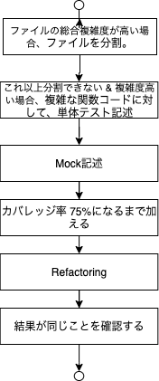

# テスト関連

## Left Shiftする
システムテストのケースを膨らませるよりも、単体テスト多くしよう。
そのためにはTDDすべし。 [^1]

# 単体テスト

## テストすべきは?

* 境界値テスト
* 状態遷移テスト

高橋さん的にはこれで80%のバグは潰せるらしい。

## カバレッジの指標はどれくらい?

Googleでの指標[^4]

> 60%: 許容範囲 (acceptable)
> 75%: 推奨 (Commendable)
> 90%: 模範的 (exemplary)

(鈴木意見: 100%目指しても良くなるとは限らない. 75%くらいが良さそうだね)

## 単体テストを部分的に反映させていくにあたっての話題
高橋さんの意見 [^1]
* 複雑度と、Hot Spot数、ファイルの行数で、バグが多そうな部分を検討し、そこに対し単体テストを追加したりフィファクタリングする。
(鈴木意見: HotSpotは現行プロジェクトだと、うまく出なさそう。)
* 複雑度の計算は、McCabe数(Cyclomatic Complexity)を参照する
* クラスに対する測定はCKメトリクス(特にWMC)を利用する。

### McCabe数に関して

#### 算出

`C = e - n + 2`
C: Complexity. 複雑度
e: プログラムが含むnを繋ぐブロック(アーク)の総数
n: プログラムが含む分岐点、合流点の総数

#### 基準

* 10以下が望ましい [^5]
* 20以下で運用している [^1]
* 30超えるとバグが増える
* 50を超えるとテスト困難

### Hot SpotのScoreに関して

簡単に言うと、頻繁に実装されている。
算出法は下記 [^2] [^3]

`Score = Σ[i=0→n]1/(1＋exp^(-12×ti＋12))`

> nは、コードに対してバグフィックスが行われた回数を示します。
> tiは修正が行われた時点のタイムスタンプで、コードが生成されたときを0、現在を1と置いて、その間の少数値をとります。
> つまり、12月1日にコードを書き始め、今日が12月30日であるとすると、15日にバグフィクスをしたらti＝0.5になります。
> ti＝0のとき、1/(1＋exp(－12×ti＋12))≒0 となり、
> ti＝1のとき、1/(1＋exp(－12×ti＋12))＝0.5 となります。

### CKメトリクス(特にWMC)に関して

CKメトリクスは、複雑者を示す6つのメトリクスの集合。
* WMC(Weighted Methods per Class)
* DIT(Depth of Inheritance Tree)
* NOC(Number Of Children of a class)
* CBO(Coupling Between Object classes)
* RFC(Response For a Class)
* LCO(Lack of Cohesion in Methods)

中でも WMCが利用しやすいため、それについて下記記載。

#### 算出

`WMC(C) = Σ[i=0→n]ci`

計測対象クラス C が，メソッド M1,…,Mn を持つとする．これらのメソッドの複雑度
をそれぞれ c1,…,cn とする。メソッドの複雑度の具体的な算出方法は述べられていないが, McCabe のサイクロマチック数などを用いる方法が考えられる．

#### 基準

* 大きいほど保守性が低い。
* 高橋さんの意見としては、20以下であるべき。 [^1]

### リファクタリング

すでに大きくなりすぎたファイルがある時のリファクタリングに関しては下記を参照すること。

[^1]: [高橋 寿一,『ソフトウェア品質を高める開発者テスト アジャイル時代の実践的・効率的なテストのやり方』,翔泳社 ,2021/3/17](https://www.amazon.co.jp/dp/B08TBD3LSS/ref=dp-kindle-redirect?_encoding=UTF8&btkr=1)
[^2]: [Google Engineering Tools, Bug Prediction at Google, 2021/07/11](http://google-engtools.blogspot.com/2011/12/bug-prediction-at-google.html)
[^3]: [Publickey, グーグルはコードの品質向上のため「バグ予測アルゴリズム」を採用している, 2021/07/11](https://www.publickey1.jp/blog/11/post_193.html)
[^4]: [Google Testing Blog, Code Coverage Best Practices, 2020/08/07/, 2021/7/11](https://testing.googleblog.com/2020/08/code-coverage-best-practices.html)
[^5]: Watson, A.H. and McCabe, T. J., "Structured TEsting : A Testing Methodology Using the Cyclomatic COmplexity Metcic", Vol.500-235, Aug. 1996

