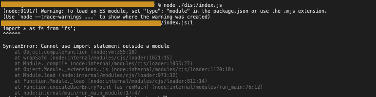

# Chrome
* How to import lodash to Chrome console?
```
fetch('https://cdn.jsdelivr.net/npm/lodash@4.17.4/lodash.min.js')
    .then(response => response.text())
    .then(text => eval(text))
```
https://medium.com/@matt.leo/how-to-import-lodash-to-chrome-console-3e5e30b4933e


# Makrdown
* use `<details>` tag to collapse
<details>
  <summary> open </summary>
  <p>
  collpased!
  </p>
</details>

# Raspberry-Pi
* https://eikihaya.hatenablog.com/entry/20170727/1501121212


## achex-sample: code sandbox


## 環境変数
`vi ~/.zshrc`で編集すること。
コマンドライン上だと、再起動すると、消える。
https://qiita.com/yakumomutsuki/items/d2fd9f103df7f728c20b

ちなみに npm へのpathは `npm bin -g`で確認可能。
adsf内の場合は、｀.asdf/installs/nodejs/15.10.0/.npm/bin｀ とかになる。

(vueを入れる時に困った。)


## package.json, tsconfig関連
### cannot-use-import-statement-outside-a-module


`"type": "module",`をpackage.jsonに
https://fredriccliver.medium.com/syntaxerror-cannot-use-import-statement-outside-a-module-69182014b8c6


### exports is not defined
```
file:///sample/dist/index.js:2
Object.defineProperty(exports, "__esModule", { value: true });
                      ^

ReferenceError: exports is not defined
    at file:///sample//dist/index.js:2:23
```

package.json
`"module": "commonjs"` -> `"module": "ES2015"`