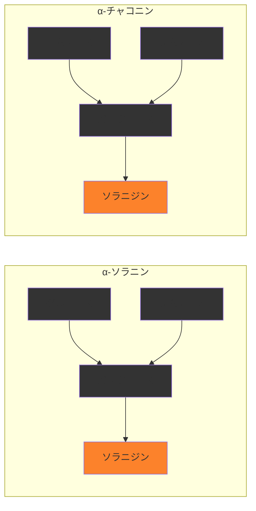

# 

## ソラニン, チャコニン 
- 概要: じゃがいもに含まれる天然毒素 [^1] [^2] [^3]
- 症状: 吐き気や下痢、おう吐、腹痛、頭痛、めまいなど
- 化学的な情報
  - α-ソラニン
    - 組成式: C45H73NO15
    - 水溶性: 水に溶けにくい
    - 分解点: 262-263℃（結晶から液晶に変化） / 285℃（著しく分解）
    - ソラニンやチャコニンは、グルコースやガラクトースなどの「糖」と、植物由来の窒素を含んだアルカリ性（塩基性）物質であるソラニジンなどの「アルカロイド」からできている「グリコアルカロイド（糖アルカロイド）」の一種

↓組成のイメージ

[^1]: https://www.maff.go.jp/j/syouan/seisaku/solanine/solanine/ganyuu/syousai.html
[^2]: https://ja.wikipedia.org/wiki/%E3%82%BD%E3%83%A9%E3%83%8B%E3%83%B3
[^3]: https://www.maff.go.jp/j/syouan/seisaku/foodpoisoning/naturaltoxin/potato.html    

## アミグダリン

- 概要: ビワ、アンズ、ウメ、モモ、スモモ、オウトウ（サクランボ）などのバラ科植物の種子に含まれる。青酸配糖体であり、咀嚼、消化の過程で有毒なシアン化物を産生する。同じく植物中に含まれる酵素エムルシンや、ヒトの腸内細菌がもつ酵素β-グルコシダーゼによる分解の働きによる。 [^4] [^5] [^6] [^7]
- 症状: 嘔吐、顔面紅潮、下痢、頭痛等の中毒症状を生じ、多量に摂取すれば意識混濁、昏睡など
- 化学的な情報
  - アミグダリン
    - 組成式: C20H27NO11
    - 水溶性: ?
    - 分解点: ?

成熟に伴いシアン化水素（青酸）、ベンズアルデヒド（アーモンドや杏仁、ビワ酒に共通する芳香成分）、グルコースに分解され消失するとのこと

[^4]: https://hfnet.nibiohn.go.jp/contents/detail678.html
[^5]: http://www2.odn.ne.jp/had26900/constituents/about_cyanogenic_glycoside.htm
[^6]: https://ja.wikipedia.org/wiki/%E3%82%A2%E3%83%9F%E3%82%B0%E3%83%80%E3%83%AA%E3%83%B3
[^7]: https://www.maff.go.jp/j/syouan/seisaku/foodpoisoning/naturaltoxin/loquat_kernels.html

## サポニン

人参や大豆などに含まれるサポニンは安全性が高く健康に良い。場合によっては毒性を持つ。

