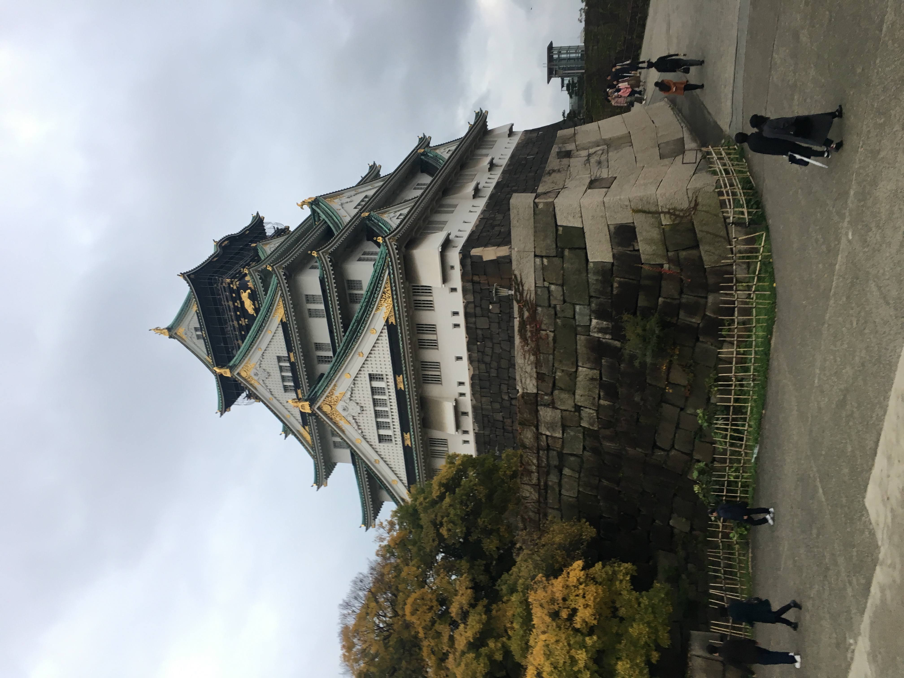
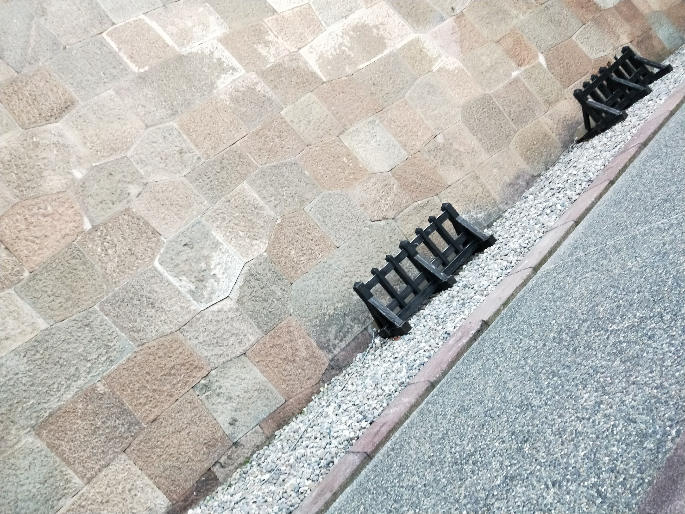
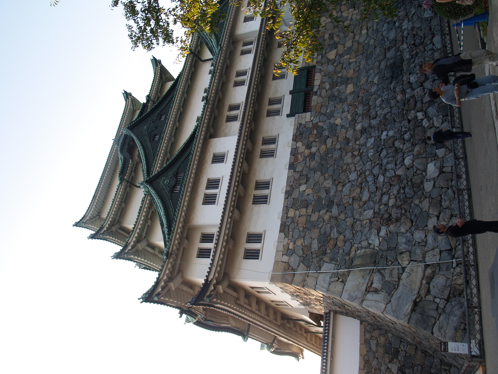

# 石垣

石垣の分類と行ったところを照らし合わせるページ。

# 石垣の種類

## 積み方

||野面づみ|打込接|切込接|
|--|--|--|--|
|布積(横目地が通る石垣)| 1. | 2. | 3.|
|乱積(横目地が通らない石垣、丈夫らしい)| 4. | 5. | 6. |

* 石材を斜めに積んだ落積/谷積もある。江戸時代後期、城郭の修築部分に出現したとされている。
* 六角形に加工した石材を利用した亀甲積などもある。
* 角は算木積。関ヶ原以降のたくさんの築城の中で、切石技術の向上に伴い、算木積増える。江戸時代では、新規の築城や改修が制限されたため、ちょっと変になっているとのこと。
# 行ったお城

## 大阪城
 

* 天守近く。3. 切込接布積。

## 金沢城

|

* 外壁。3. 切込接布積。一部乱積のところもあり。外堀の方は、確か野面積みだった。

## 名古屋城

* 5. 打込接乱積。天守閣近く。後に積み直した部分は、切込接布積が増えているらしい。 [^1]

[^1]: 西元昌司, 2020年7月, 名古屋城石垣に使われている石材の岩石種,　地質学雑誌第126巻 第7号, 343-353ページ, https://www.jstage.jst.go.jp/article/geosoc/126/7/126_2020.0018/_pdf

## 彦根城
 

* 打込接乱積。一部、修理が入った部分で、谷積を見ることができる。[^2] [^3]

[^2]: http://www.hat.hi-ho.ne.jp/moch/castle/castle_klg04.htm
[^3]: https://blog.kojodan.jp/entry/2019/03/02/113353

