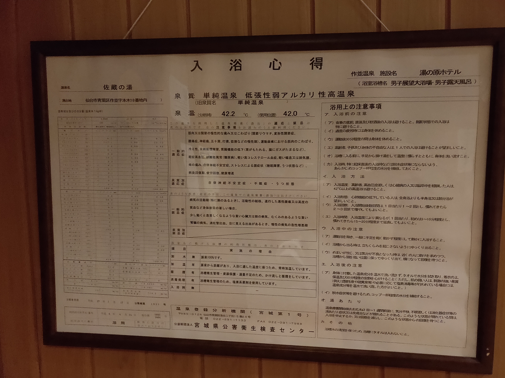

draft..
# 行った/行ってない MEMO
## 行った
### 東北
* 青森県
  * [蔦温泉](https://tsutaonsen.com/)  
  2018?? 個人的ベスト。
  * [酸ヶ湯温泉](http://www.sukayu.jp/)
  2018?? 酸っぱい。もはや美味しい。
  * [青荷温泉](https://www.aoninet.com/pc-index.html)
  2018?? ランプの宿自体が良いので、それも含めて気持ち良い。
  * [黄金崎不老ふ死温泉](https://www.furofushi.com/)
  2018?? 遅くなってしまって、海に面した方は入れていないので、リベンジした。ただ内湯でも銅のかほりつよし。
* 岩手
  * [鉛温泉](https://www.namari-onsen.co.jp/)
  特殊な温泉。結構好き。立ってはいる。確かそんなに熱くなかった。ユーったり入れる。女性でなければ。
  * [大沢温泉](https://www.oosawaonsen.com/)
  確か湯治屋という旅館に泊まったはず。その旅館も相まってかなり良かった。露天風呂に入ったのが夜になってしまったが、また昼落ち着いてきたい。
  * [悠久の湯 平泉温泉](https://www.town.hiraizumi.iwate.jp/index.cfm/25,0,125,271,html)
  出た後に、結構肌の乾燥もすごく、手放し良いとは言えない。奥まっている元湯?の奥州平泉温泉がある方に行ったほうが良いか..?
* 宮城
  * [作並温泉](http://www.sakunami-spa.com/)
    * 佐蔵の湯@湯ノ原ホテル
    無色透明、クセがなく気持ち良い。
    
  * [秋保温泉](http://www.akiuonsenkumiai.com/)
  共同浴場に確か行ったはず。普通に良かった。

### 関東
* 群馬
  * [赤城温泉 湯の沢館](http://yunosawakan.com/)
  reasonable! it's little hard to visit but there is good atomosphere. An ingredient is copper. 
    
* 栃木
  * 鬼怒川温泉
  * [那須温泉 鹿の湯](http://www.nasuonsen.com/history/)
  630年、狩野三郎行広の発見に始まったそう。硫黄臭があり、入ったあとのあったかさずっと続く。40-46度の温泉に分かれており、バラエティ性もある。かなり好き。
* 茨城
  * 筑波温泉
  塩素の香り強め。
* 埼玉
* 東京
* 千葉
* 神奈川
  * [鶴巻温泉 元湯陣屋](https://www.jinya-inn.com/databox/data.php/hot_spring_ja/code)
  陣屋自体が心地よかったが、内湯で満足してしまった。14:00までなら、客室側の方も行けるらしいので、そこに行きたい。行きやすいのでリベンジ候補。
  * 箱根湯本温泉
  * 強羅温泉
  * [七沢温泉 七沢荘](https://www.nanasawasou.jp/)
  スピリチュアルだけど、良い温泉。という評判通り。
    
* 山梨
  * [ほったらかし温泉](http://www.hottarakashi-onsen.com/)
  泉質も良いし、何より景色が気持ち良い。

### 中部
* 静岡
  * [土肥温泉 たたみの宿 湯の花亭](https://www.toi-yunohanatei.com/)
  無色透明、味なし。畳が敷かれた露天風呂があるのだが、やっぱりお尻に
  * [修善寺温泉 湯回廊 菊屋](https://www.hotespa.net/hotels/kikuya/)
  アルカリ性単純温泉、無色透明、味なし。旅館が最高であった。昔から続く温泉宿でありながら、部屋は新しく最後まで心地よい。
    
* 新潟
  * [越後湯沢温泉](https://www.snow-country-tourism.jp/)
  スキーついでに、行った。すごい気持ち良いのは寒かったからか..
* 長野
  * [白骨温泉](http://www.shirahone.org/)
  弱酸性の乳白食の温泉。子供の時に行ったきり、もう一度行ってみたい。
  * 那須温泉 - 那須マウントホテル
* 岐阜
  * [下呂温泉](http://www.gero-spa.or.jp/)
* 石川
  * 和倉温泉
  * 山中温泉
* 福井

### 近畿

### 中国

### 四国
* 愛媛  
  * 道後温泉
* 香川
* 高知
* 徳島
### 九州
* 福岡
* 大分
  * [由布院温泉](http://www.yufuin.gr.jp/)
    * [束の間の湯](https://tsukanoma.club/)
    青くにごったお湯。ぬるめでとても良かった。ナトリウム−塩化物泉
  * 別府温泉郷
    * [明礬 湯の里温泉](http://www.gokuraku-jigoku-beppu.com/entries/search/MYOUBAN)
    この明礬による入浴剤剤は本当に体あったまる！！！
    * [鉄輪温泉](http://www.gokuraku-jigoku-beppu.com/entries/search/KANNAWA?page=2)
      * 鉄輪むし湯
    * [竹瓦温泉](http://www.gokuraku-jigoku-beppu.com/entries/takegawara-onsen)
    無骨なみためと、入ったあとのあったまりは気持ちよい。
  * 
* 熊本
  * [黒川温泉](https://www.kurokawaonsen.or.jp/)
    * [夢龍胆](https://www.yumerindo.com/index.html)
    * 他
* 宮崎

## 行ってみたい
### 東北
* 青森県
  * [恐山温泉 宿坊吉祥閣](https://www.aptinet.jp/Detail_display_00004276.html)
* 秋田県
  * 乳頭温泉
  * 田沢湖高原温泉郷
  * 十和田大湯温泉
* 宮城
  * 鳴子温泉
  * 気仙沼温泉
* 山形
  * [銀山温泉](http://www.ginzanonsen.jp/)
* 福島
  * 飯坂温泉

### 関東
* 群馬
* 栃木
  * 奥日光湯元
  * 奥塩原新湯温泉（オクシオバラアラユ）
* 茨城
* 埼玉
* 東京
* 千葉
* 神奈川
* 山梨
* 

### 中部
* 新潟
* 長野
  * [白馬鑓温泉](https://www.hakuba-sanso.co.jp/yamagoya/yarionsengoya.html)
  [Wiki](https://ja.wikipedia.org/wiki/%E7%99%BD%E9%A6%AC%E9%91%93%E6%B8%A9%E6%B3%89)
* 岐阜
* 石川
  * 山代温泉
  * 片山津温泉
  * 辰口温泉
  * 湯涌温泉
* 福井
### 九州
* 福岡
* 大分
  * 宝泉寺温泉
* 熊本
* 宮崎
* 鹿児島
  * 指宿温泉
  * [妙見温泉](http://www.myoken-onsen.com/)

### 近畿

### 中国

### 四国
* 愛媛  
  * 道後温泉
* 香川
* 高知
* 徳島
  
## Ref:
* [山の温泉ガイド](https://www.mountaintrad.co.jp/)
* [野湯 秘湯 リスト(全国) 山の温泉ガイド](https://www.mountaintrad.co.jp/overall/noyu_public.html)

# 勉強
## 温泉の種類
### 温泉の発生元
#### 火山性温泉
* 地表に染み込んだ雨や雪が、マグマの熱によって温められたもの
泉質の形成
  * マグマのガス成分の混入
  * マグマの熱水溶液の混入
  * 温泉の流動による、岩石の成分の溶解
#### 非火山性温泉 - 深層地下水型
高温岩帯や地下増温率による地熱を熱源として温められたもの
※ 高温岩帯 .. マグマが冷えた高温の岩石がある場所
※ 地下増温率 .. 深度が深くなるほど地温が上昇し、一般的に100mごとに温度が約３℃ずつ上昇すること。
#### 非火山性温泉 - 化石海水型
太古の地殻変動などで地中に閉じこめられている古い海水を元とする温泉。

※ [Ref](https://www.spa.or.jp/onsen/492/)

### 温泉の色による分類
* 白色系(乳白色・灰白色・黄白色)
  * 乳白色: 硫黄化合物 (酸性が強く硫化水素の濃度が高いほど濁りが発生しやすい)
  * 乳白色: 泥や粘士質が含まれている
* 青色系(水色・青白色)
  * 水色: メタ珪酸（シリ力）の含有量が多い　+ 高温
  * 青白色: 上記 + 硫黄化合物
* 赤色系(赤色・赤褐色)
  * 赤色: 鉄分を含む温泉が参加した水酸化第2鉄を多く含む。（酸性が強いと沈殿が起こりにくい）
* 緑色系（緑色・黄緑色）
  * 淡い緑色: 酸性鉄泉
  * 黄緑: 中性|アルカリ性 硫黄泉 硫化水素
* 褐色系(黒褐色・茶褐色)
  * 黒褐色: 腐植質が多い
  * 茶褐色: 腐植質がそこまで
  ※腐植質 .. 古い時代のシダ植物や海藻類が地中で分解されてできた有機化合物
https://www.spa.or.jp/onsen/3977/

### 

