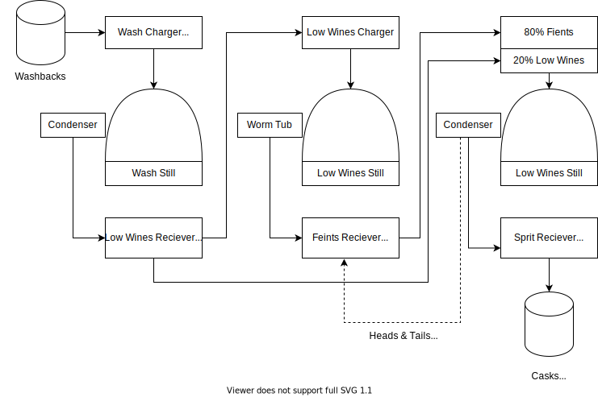
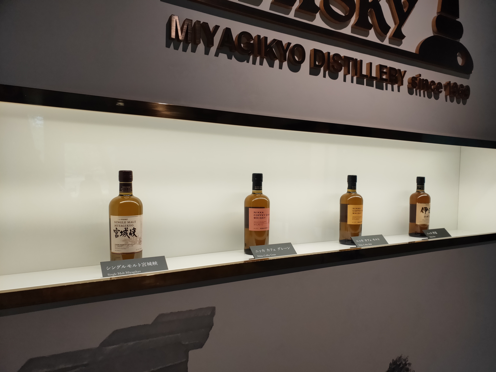
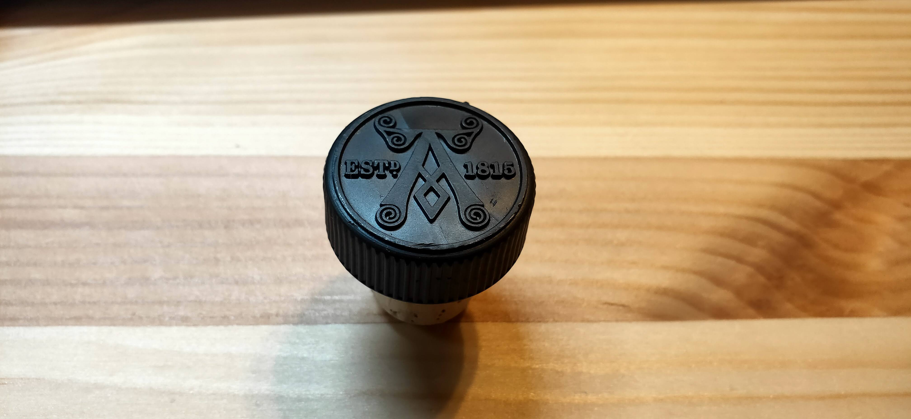
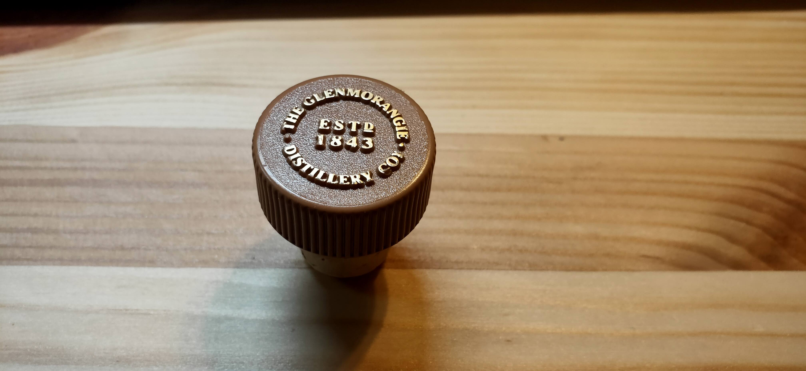
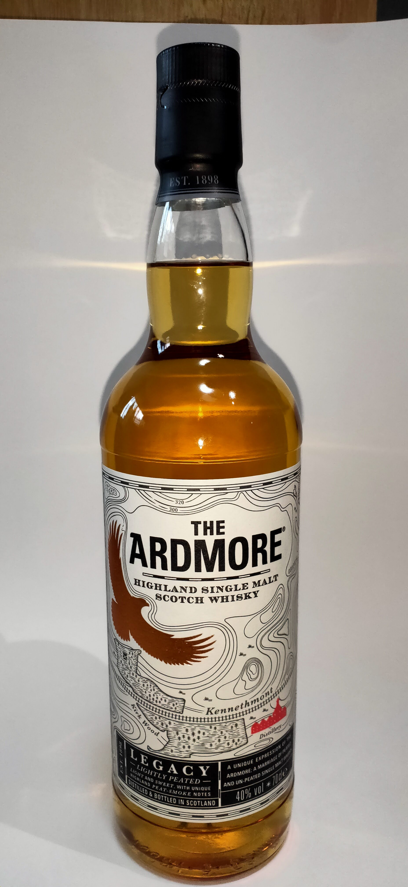
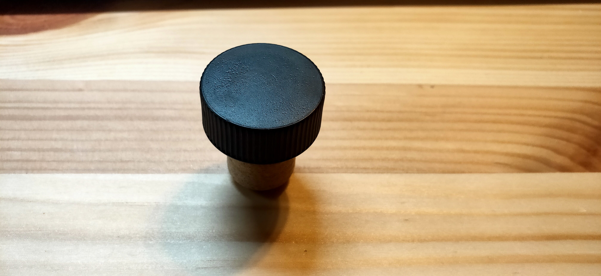

# 概要

スモーキーなウィスキーが好み。

# ウイスキーの作り方基本

## アルコールの作り方分類

## 単式蒸留の説明

## 単式蒸留時の加熱方法分類

# 飲んできたやつ

## 宮城峡

https://www.nikka.com/distilleries/reason/reason01.html

## Bowmore

樽の香りが強く、自分がウィスキーの中で2番好きなウィスキー。

## Laphroaig シングルカスク

スモーキーで、自分がウィスキーの中で一番好きなウィスキー。
ベトナム駐在中のお供。

1815年に蒸留所のマネージャーから引き継がれてずっと守られた味。

アイラ島のピートは、スコットランド本土のものとは違い。高い比率のミズゴケが存在するため、薬的な香りもつく。
ラフロイグのカットは遅い。45分後に最初のカットを行う。スピリットのアルコール含有量が60％に低下したら、2番目のカットを行う。

https://www.laphroaig.com/en/

## Glenmorangie

<!--  -->
ほのかなさわやかなか香りが、夏のピッタリ。主に、ハイボールで飲んでいた。
品があるけど、そこまで高くなくて毎年買いたいかも。

## Ardmore

<!--  -->
  

樽の香りは結構あるけど、お酒の強さもあってるから、ラフロイグとかの方が好きかも。

## Glenfiddich

* ゲール語で「鹿の谷」
* 1887年、スコットランド北部に位置するスペイ川流域に、ウィリアム・グラント氏が始める

# Glossary

* シングルカスク .. 1の樽のウイスキーだけを瓶詰めしたウイスキー  
* シングルモルト .. 1つの蒸溜所で製造され、原料には大麦麦芽だけを使っているウイスキー  
* ピュアモルト .. シングルモルト同士を混ぜる  
* グレーンウィスキー .. 大麦麦芽とトウモロコシ、小麦、大麦など様々な穀物を原料にしたウイスキー  
* クオーターカスク .. 通常の1/4ほどの大きさしかない小さい樽を利用したウイスキー。原酒全体に対する樽材と触れる割合が多くなるため、熟成が早まる。
* distillery .. (特にウイスキー・ジンなどの)蒸留酒製造所
* ピート .. とは、ヒースというスコットランド北部の原野に多い野草や水生植物などが、炭化した泥炭（炭化のあまりすすんでいない石炭）です。
* 単式蒸溜において、初留を行う釜 .. ウォッシュスチル、ビールスチル、初溜釜
* 単式蒸溜において、再溜を行う釜 .. ローワインスチル、スピリットスチル
* ウォッシュ .. 発酵液、醪、ディスティラーズ・ビール
* スピリッツ .. ウィスキー。カットするものも含まれる
* ミドルカット .. Head や Tail部分をカットすること。樽での熟成を考えて、醸造所それぞれで、個性が出る部分。
* ヘッド .. 刺激臭が強い。熟成に適さない。フォアショット、前溜と呼ばれる。
* テイル .. 雑味、香ばしさがある。残しすぎると、泡盛のようになっていくらしい。
* ハート .. ボディ、本溜、中溜とも呼ばれる。樽に入ることを許された蒸溜液。
* フィインツ .. ヘッドとテイルを合わせたもの。

# Reference

* ウイスキーのマガジンサイト  
http://whiskymag.jp/

* スコッチウイスキーの製法に関して、かなり詳しく紹介されている  
https://www.undiscoveredscotland.co.uk/usfeatures/maltwhisky/index.html

* ミドルカットについてのわかりやすい記事  
https://www.bottles.jp/hpgen/HPB/entries/167.html

* 蒸溜時の加熱方法に関してわかりやすい記事  
https://www.suntory.co.jp/whisky/museum/know/jouryu/houhou2.html

* サントリーのウィスキーQ&A  
https://www.suntory.co.jp/customer/faq/whisky-brandy/

