# サブスクリプション

この記事はここ。

リカーリング: 定期的支払いが発生するが、サブスクリプションと比較し、従量課金型(変動型)のことを指すことが多い。電気代・水道代・コピー機のトナーやインクカートリッジなどが例。

|                |        | 買切り   |    サブスクリプション                                                       |
| -------------- | ------ | ------------------------------------------------------------------------------------- | ------------------------------------------------------------------------------------------------- |
| 支払い方法     |        | 購入時に一時払い                                                                      | 月額または年額といった定期的な支払いい                                                            |
| サポート・保証 |        | 指定された期間のみ対応                                                                | 契約期間中は常時対応                                                                              |
| メリット       | 消費者 | 製品を所有できるので、好きな時に利用できる                                            | 初期費用が安い/契約期間中は万全のサポートや補償を受けられる/常に最新の製品を利用できる            |
| メリット       | 事業者 | 販売時点で大きな利益を得られる                                                        | 長期的な利益を得られる。製品やサービスを改善できる                                                |
| デメリット     | 消費者 | 初期費用が高額/サポートや保証期間が終了したり、製品が古くなったりしたら買い直しが必要 | 契約期間が終了したら利用できない。製品やサービスによっては返却も必要/使用しなくても料金が発生する |
| デメリット     | 事業者 | 消費者との関係性は短期的/ユーザニーズが把握しにくい                                   | 短期的な利益は少ない                                                                              |

## サブスクリプションの分類

|モデル種別|概要|適している||
|--|--|--|--|
|定期購入モデル|定期的な配送。Amazon定期便.|サプリメント、基礎化粧品、食品飲料、雑誌、日用品 (日常的に利用し、習慣性のあるもの)|顧客はより良い商品をより安価に手に入れられる。企業は在庫売上計画を立てられる|
|頒布会モデル|毎回異なる商材を販売するモデル. |食品飲料、化粧品、雑貨 (日常的に使用し、種類が豊富で選ぶのが困難なもの)|顧客はさまざまな商品を楽しめ、企業は在庫、売上計画を立てやすい。|
|会員制モデル|サービスやコンテンツを利用する権利を貸与するモデル。NetFlix|SaaS, デジタルコンテンツ, レンタル,実店舗(飲食店、ジム、教室、エステなど） (時間や金額などに制約が起こりがちなもの)|顧客はサービスを好きなだけ利用できる。企業はリピーターを獲得しやすい|
|レコメンドモデル|会員に合わせて、商品を提供するモデル. PostCoffeeなど.|ファッション、食品、雑貨、デジタルコンテンツ(不確定要素が多く、顧客の嗜好や特性に左右されるもの)|顧客は自分に適した商品やサービスを享受できる。企業は強固な顧客ロイヤルティを得る。提供するサービスに関する専門家、データ収集・分析に関するテクノロジー、顧客/専門家/商品の3つを包括的に管理できるシステムが必要。|

## サブスクリプションがマーケティング的に優れている部分

||Easy Description|主にここに力を入れているサービス例|
|--|--|--|
|定期購入性|スーパーなどで都度購入する必要なし|オンラインショップ|
|成果重視性|ビジネスで成果を出しやすい。契約即使い初めて、さっと辞めることが可能|Adobe, Office365|
|メンテナンス性|ユーザーはメンテナンス入らず。|タイムズカーシェア, KINTO|
|利用のランダム性|駐在など環境が大きく変わって不要になった場合、即解約可能. |メンバーシップを一時停止できるYouTube Music Premium|
|インフラ性|長期に渡る利用があると脱し難い|iCloud, Dropbox, Google Driveなど|
|アップデート性|最新のものを利用できる|Adobe|
|保険性|期限がない保証が可能||
|デジタル性|全てデジタルなので、それに応じた内容のアップデートが可能。同一アカウントでの複数端末ログイン・サブスクリプションプラットフォームを作りやすい、など|Apple Music / SubscLamp|
|ファッション性|トレンドを入れ込むことができる。交換費用が嵩まないことが重要。|バッグレンタルサービスLaxas|
|経済性|少額で開始可能（事業者は機会獲得). ニーズに合わせて購入可能(事業者は生産費用を抑制)。保管維持費用抑制|Apple Music|

## サブスクビジネスの進め方

自ら作成

### 客単価
-> 値段は下記をベースに決めることが多い

|価格設定方式|説明|
|--|--|
|コスト基準型|原価や諸経費に理系を上乗せした価格設定|
|競争基準型|同業他社の相場価格を基準とし、品質を考慮して価格を上下させる方法|
|マーケティング戦略基準型|顧客属性に応じて複数の価格プランを用意するなど顧客を中心に設定.グーテンベルグ仮説も参考になる|

* ユニットエコノミクスの損益分岐点　　
売上高(販売価格×平均継続回数×顧客数)-原価-広告費-諸経費=利益

* プラスで、お金だけでは測れないLINEスタンプや、優先席月などの経済合理性を算出しにくい状態にするのがさらに良し。

### 用語集

* 顧客満足度 .. サービス自体のもたらす満足度。競合他社と比較されやすい。
* 顧客エンゲージメント .. 提供者と利用者の間に生じる関係。競合他社と比較されにくい。
* NPS .. ネットプロモータースコア. 推奨者の割合 - 批判者の割合
* ユニットエコノミクス .. 顧客または、アカウントあたりの経済性を基準として損益罫線する方法。LTV / CAC > 3 が健全性の目安。　
* LTV .. 顧客生涯価値。顧客あたりの期間収益（平均) / チャーン率(解約率)。顧客満足度や顧客エンゲージメントが高いとLTVも高くなる。
* Customer Acquisition Cost(CAC) .. 顧客獲得コスト. 顧客獲得にかかる総コスト / 新規顧客獲得数 > 1なら黒字。チャネルごとにCACを比較すると費用対効果の高いチャネルがわかる。
* 引き上げ率 .. 無料期間などから引き上げられた顧客数の率。登録された顧客数/単位期間あたりの顧客数。
* 継続率 .. 前月から次月に引き続き利用された顧客の数の率. 月額の場合、次月の顧客数/前月の顧客数。
* 休止 .. 定期配送便などだと、家を一時的に3ヶ月あけるなどがあるかもしれない。そのための対応。解約ではなく休止。
* 紹介プログラム .. クーポンコードなどによる、他社からの推薦を受け付けること。  

### BtoB VS BtoC

||BtoB|BtoC|
|--|--|--|
|重要な施策|利用者を少しでも多く獲得して、長く継続させる施策|顧客エンゲージメントを高めるための施策|
|Before|小額/競合多い/利用者との接触少ない|既存顧客多い/競合少ない/顧客管理がアナログ|
|After|新規顧客獲得/差別化/コミュニティの強化|エンゲージメント強化/関連サービスの営業強化/顧客管理のデジタ化|

#### BtoC

* 新規顧客獲得には..  
  * フリーミアム戦略 (プラン作成と価格設定が重要)
  * 解約と更新をスムーズにする。（参加障壁を下げる)

* コミュニティの強化には..
  * 紹介者プログラム
  * 利用者とのコミュニケーションの場を用意し、チャーン率を下げ、結びつきを強化する

#### BtoB

* エンゲージメント強化には.. (理由: )
  * 既存巨買うから集めたデータを分析して、満足度を向上
  * 収益構造の最適化
  * 顧客あたりの平均収益(ARPA)を増大させる
* 関連サービスの営業強化には..
  * デジタルタッチポイントふやす（営業だけでは、差が出る)
  * クロスセル/アップせる (BtoCよりも大きい効果)
  * 営業先を現場にむかせる (ニューレリックは経営層ではなく、技術者と直接つながりを持った。クロスセルの売上増大)
  * パッケージ戦略（ものではなくことをうる。経済合理性も算出しにくい。）
  * 販売代理店（ちゃんと利用者からフィードバックを得られないと、サブスクリプションの好循環は得られない)
* トライアル期間の設定

## 今後
* AIによるパーソナライズ
* 定額制による物売り -> 物売りをことうりに -> ことうりをさらに変質させる
* サービス同士をシームレスに連係 (ここであったMaasをまとめて、旅行をサブスクにするなど)

## REF
* [サブスクリプション実践ガイド――安定収益を生み出すビジネスモデルのつくり方](amazon.co.jp/dp/B07T6641Z7/ref=dp-kindle-redirect?_encoding=UTF8&btkr=1)
* [60分でわかる！　サブスクリプション](https://www.amazon.co.jp/60%E5%88%86%E3%81%A7%E3%82%8F%E3%81%8B%E3%82%8B%EF%BC%81-%E3%82%B5%E3%83%96%E3%82%B9%E3%82%AF%E3%83%AA%E3%83%97%E3%82%B7%E3%83%A7%E3%83%B3-%E3%83%AA%E3%83%B3%E3%82%AF%E3%82%A2%E3%83%83%E3%83%97-ebook/dp/B084D81P3L)

